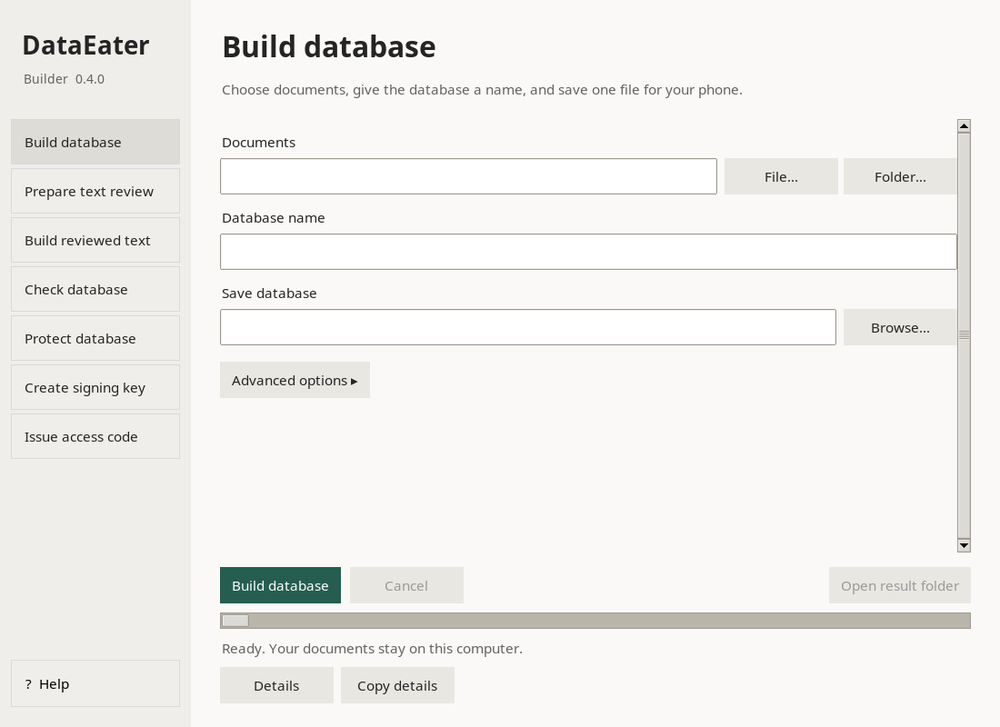

# DataEater Builder

Turn PDFs, text and Markdown into `.dataeater` knowledge databases for the DataEater Android app.

**A simple Linux desktop, with terminal commands when you need them.**



## Install the desktop

Download `dataeater-builder_0.4.0_all.deb` from this repository's **Releases** page. Open it with your software installer, or run:

```bash
sudo apt install ./dataeater-builder_0.4.0_all.deb
```

Open **DataEater Builder** from your applications menu. The package targets Debian 13. Other Debian-family distributions need the required dependencies and are not yet tested.

Choose **Build database**, select your documents, enter a name and save the result. Use **Check database** before sharing it. **? Help** explains every task offline.

| Task | What it does |
|---|---|
| Build database | Turn PDF, TXT or Markdown into one database |
| Prepare text review | Export editable text and an instruction prompt |
| Build reviewed text | Build checked edits with original page references |
| Check database | Verify fingerprints and inspect passages |
| Protect database | Create an encrypted database |
| Create signing key | Create a private key and its public key |
| Issue access code | Unlock a protected database for one phone |

Advanced options stay collapsed until needed. Work runs in the background with progress and cancellation. The desktop and terminal use the same engine and file format.

See the [desktop guide](docs/GUI.md) for installation, screenshots, output safety and troubleshooting.

## Terminal setup

Python 3.10 or newer:

```bash
python3 -m venv tools/.venv
tools/.venv/bin/pip install -r tools/requirements.txt
chmod +x tools/dataeater-builder tools/dataeater-builder-gui
```

Run commands from this project folder. The terminal launcher uses its private environment automatically. To run the desktop from source, follow the [system Tk setup](docs/GUI.md#run-from-source).

## Build directly

```bash
tools/dataeater-builder build /path/to/manuals -o manual.dataeater --name "My Technical Manuals"
tools/dataeater-builder inspect manual.dataeater
```

Input can be one PDF, TXT or Markdown file, or a folder. Scanned PDFs need OCR first. Images and diagram relationships are not reconstructed automatically.

## Review extracted text

1. Export editable batches and a prompt:

```bash
tools/dataeater-builder review /path/to/manual.pdf -o exports/manual --batch-chars 30000
```

2. Read `exports/manual/LLM_PROMPT.txt`. Give the prompt and one file from `original/` to your chosen LLM only when sharing that document is authorized. Nothing is uploaded automatically.
3. Save the complete returned text over the matching file in `reviewed/`. Keep uncertainties in `notes/`. Check numbers, units, warnings and part identifiers against the PDF.
4. Build the checked result:

```bash
tools/dataeater-builder build-reviewed exports/manual -o manual.dataeater --name "My Technical Manuals"
tools/dataeater-builder inspect manual.dataeater
```

The prompt asks for extraction and formatting corrections, not rewriting, summaries or invented technical information. Original fingerprints and page markers are validated, but those checks do not prove technical accuracy. Keep `original/` and `review.json` unchanged. Never build directly from the entire export folder.

The same workflow is available through **Prepare text review → Build reviewed text** in the desktop.

## Documentation

- [Desktop and offline help](docs/GUI.md)
- [Builder commands](docs/BUILDER.md)
- [Database format](docs/DATABASE_FORMAT.md)
- [Encryption and access codes](docs/ENCRYPTION_DESIGN.md)
- [Release notes](docs/RELEASE_NOTES_0.4.0.md)
- [GitHub publication](docs/PUBLISHING.md)

## Tests and packages

```bash
for test in tools/tests/test_*.py; do tools/.venv/bin/python "$test" || exit; done
python3 packaging/linux/build_deb.py
```

Tests cover passage preservation, reviewed PDF round trips, encryption, licensing, archive validation and desktop command parity, cancellation and output rollback. The [desktop guide](docs/GUI.md#development-checks) explains graphical smoke testing.

## License

Copyright 2026 Jack. Original code and documentation: [Apache 2.0](LICENSE).

PyMuPDF/MuPDF uses AGPLv3 or a commercial licence. Apache licensing of original code does not override dependency obligations. The Debian package does not bundle dependency binaries. See [third-party notices](THIRD_PARTY_NOTICES.md).

Input documents and database content retain their own rights. Only share material you have permission to distribute.
