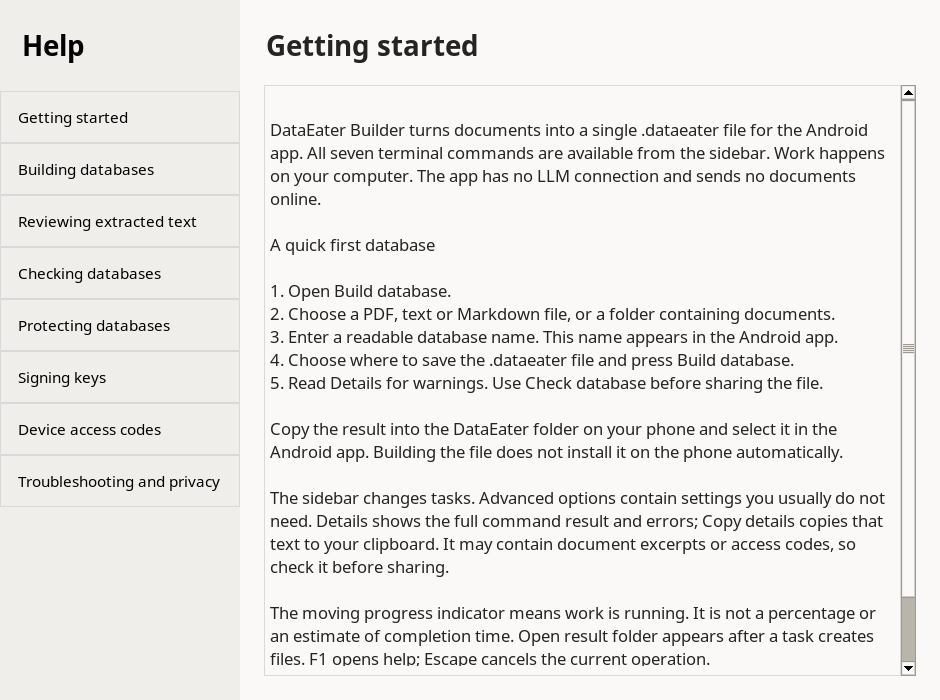

# Linux desktop

DataEater Builder has a desktop interface and a terminal interface. Both use the same database engine and Android-compatible file format.


## Install the Debian package

The tested package target is **Debian 13**, using the distribution's Python, Tk, PyMuPDF and cryptography packages. Other Debian-family distributions need these packages at the required versions; they have not been tested. The architecture-independent package contains Python source, not bundled native libraries.

Download `dataeater-builder_0.4.0_all.deb`. Open it with your distribution's software installer, or run this command from its download folder:

```bash
sudo apt install ./dataeater-builder_0.4.0_all.deb
```

An internet connection may be needed to install dependencies. Afterwards, building, reviewing, encryption and help work offline. No document upload is performed.

Open **DataEater Builder** from your applications menu. The commands `dataeater-builder-gui` and `dataeater-builder` are also installed.

To remove the application:

```bash
sudo apt remove dataeater-builder
```

Documents, databases and private keys in your own folders are not removed.

## Build your first database

1. Select **Build database** in the sidebar.
2. Use **File…** for one document or **Folder…** for a document collection.
3. Enter a database name and choose **Save database → Browse…**.
4. Press **Build database**. The progress indicator moves while work is running.
5. Check **Details** for extraction warnings. Use **Check database** to verify the file.
6. Copy the resulting `.dataeater` file to the DataEater folder on your Android phone and select it in the app.

The indicator does not estimate a percentage. **Cancel** stops work and keeps existing outputs. **Open result folder** opens the saved file's folder after success. Forms and logs are not saved between launches.

## Tasks

| Sidebar task | Terminal command | Result |
|---|---|---|
| Build database | `build` | Database from PDF, TXT or Markdown |
| Prepare text review | `review` | Original/editable text batches and LLM prompt |
| Build reviewed text | `build-reviewed` | Validated database with original page references |
| Check database | `inspect` | Fingerprint and passage-quality report |
| Protect database | `encrypt` | Locked database plus private content key |
| Create signing key | `create-key` | Private key plus public key in Details |
| Issue access code | `licence` | Device-bound unlock code, optionally a `.lic` file |

Every command option is available in the forms. Less common metadata, passage/batch sizes, expiry and key replacement are under **Advanced options**. The older `build --review` route is available as **Export review instead**, although **Prepare text review** is simpler.

## Help and review

Press **? Help** or **F1**. The offline help explains each task, PDF/OCR limits, text review, signing keys, device access, privacy and troubleshooting. The same text is in [docs/help](help/).

A review export contains `original/`, `reviewed/`, `notes/`, `LLM_PROMPT.txt` and `review.json`. Share one batch with an external LLM only when authorized. Save complete checked text in the matching `reviewed/` file. Preserve all page markers and verify technical changes against the PDF. Use **Build reviewed text**, never **Build database** on the whole export folder.



## Keys and output safety

Keep `.key` and `.secret` files private and backed up. Locked databases need the correct public signing key to verify access codes. Existing content keys are reused unless replacement is explicitly selected. Existing signing keys cannot be replaced without enabling the replacement option and confirming it.

The desktop stages output in private temporary folders beside each destination. It publishes files after the command succeeds and rolls back ordinary final-move failures. Cancellation and command errors preserve previous outputs. This is not crash-atomic across multiple files: sudden power loss can interrupt final moves or leave hidden `.dataeater-*` folders with private data. Retain secure backups and remove abandoned staging folders when no operation is running.

Details can include document excerpts, key paths and access codes. Review copied details and screenshots before sharing them. No telemetry or automatic API calls are included.

## Run from source

Install Tk for the **system Python** and create the builder's private dependency environment:

```bash
sudo apt install python3-tk python3-venv
/usr/bin/python3 -m venv tools/.venv
tools/.venv/bin/pip install -r tools/requirements.txt
chmod +x tools/dataeater-builder tools/dataeater-builder-gui
tools/dataeater-builder-gui
```

The source launcher uses `/usr/bin/python3` for Tk and the private `tools/.venv` for worker commands when present. This avoids depending on Tk in an unrelated Python installation. Run the desktop as your normal user, in a graphical Linux session.

## Build a package

From the project root:

```bash
python3 packaging/linux/build_deb.py
```

This requires `dpkg-deb` and does not install packages, run maintainer scripts or access the network. The generated `.deb` declares `python3-tk`, `python3-pymupdf >= 1.24` and `python3-cryptography >= 42` as system dependencies. Dependency binaries are not bundled. Their licences still apply; see [third-party notices](../THIRD_PARTY_NOTICES.md).

## Development checks

```bash
for test in tools/tests/test_*.py; do tools/.venv/bin/python "$test" || exit; done
/usr/bin/python3 tools/tests/desktop_smoke.py
```

The desktop smoke check needs system Tk, a graphical display and the worker dependencies. It runs all sidebar operations on invented documents, opens every help topic and checks scrolling at the minimum window size. Use `xvfb-run -a` for a virtual display on Linux CI.

The event loop stays on the Tk thread. Child processes perform CLI work, and a queue returns results to the UI. This follows [Python's Tk threading guidance](https://docs.python.org/3/library/tkinter.html#threading-model).

Prepare source, Debian package, notes and checksums together:

```bash
python3 packaging/linux/build_release.py --validation /path/to/VALIDATION.md
```

Only explicitly selected source, tests, documentation and synthetic screenshots enter the ZIP. Check the validation report before publishing.
